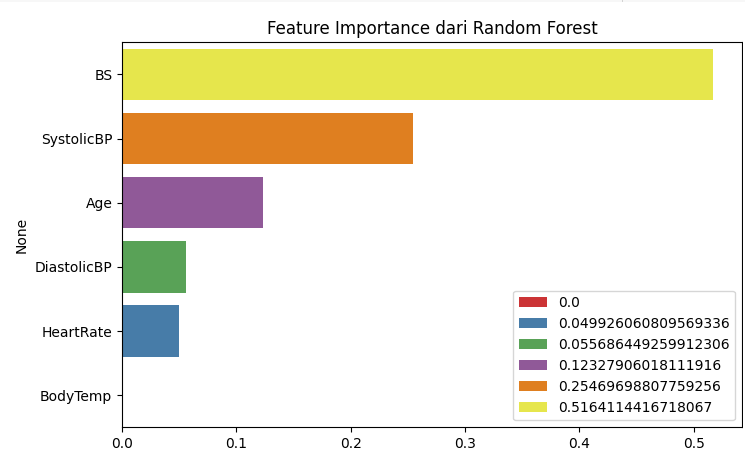

Berikut adalah contoh `README.md` yang relevan untuk proyek prediktif risiko kehamilan menggunakan berbagai model machine learning:

---

# Prediksi Risiko Kehamilan dengan Machine Learning

Proyek ini bertujuan untuk memprediksi tingkat risiko kehamilan (`low`, `mid`, `high`) berdasarkan data medis ibu hamil dengan menggunakan berbagai algoritma machine learning, yaitu: **SVM**, **KNN**, **Random Forest**, dan **XGBoost**.

## 📁 Struktur Proyek

```
.
├── predictive_analysis_maternal_risk.ipynb
├── README.md
├── images/
│   ├── confusion_matrix_svm.png
│   ├── confusion_matrix_knn.png
│   ├── confusion_matrix_knn_tuned.png
│   ├── confusion_matrix_rf_tuned.png
│   ├── accuracy_comparison.png
│   └── feature_importance.png

```

## 📊 Dataset

Dataset berisi fitur-fitur medis seperti tekanan darah, usia, dan status gula darah, dengan target label berupa kategori risiko (`0` = rendah, `1` = sedang, `2` = tinggi).

## 🔍 Model yang Digunakan

1. **SVM (Support Vector Machine)**

   - Akurasi: 53.85%
   - [Confusion Matrix](images/confusion_matrix_svm.png)

2. **KNN (K-Nearest Neighbors)**

   - Akurasi awal: 62%
   - Akurasi setelah tuning: 67.03%
   - [Confusion Matrix Sebelum Tuning](images/confusion_matrix_knn.png)
   - [Confusion Matrix Setelah Tuning](images/confusion_matrix_knn_tuned.png)

3. **Random Forest**

   - Akurasi setelah tuning: 71.43%
   - [Confusion Matrix Sebelum Tuning](images/confusion_matrix_rf.png)
   - [Confusion Matrix Setelah Tuning](images/confusion_matrix_rf_tuned.png)

4. **XGBoost**

   - Akurasi: 65.93%
   - [Confusion Matrix Sebelum Tuning](images/confusion_matrix_xgb.png)
   - [Confusion Matrix Setelah Tuning](images/confusion_matrix_xgb_tuned.png)

> Perbandingan akurasi setiap model ditampilkan pada grafik berikut:
> 

## ⚙️ Contoh Kode Pelatihan Model

Berikut adalah contoh pelatihan model Random Forest:

```python
from sklearn.ensemble import RandomForestClassifier
from sklearn.model_selection import train_test_split

# Split data
X_train, X_test, y_train, y_test = train_test_split(X, y, test_size=0.2, random_state=42)

# Model
rf = RandomForestClassifier(n_estimators=100, max_depth=5, random_state=42)
rf.fit(X_train, y_train)

# Prediksi
y_pred = rf.predict(X_test)
```

## 🧪 Evaluasi Model

Evaluasi dilakukan menggunakan:

- Confusion Matrix
- Precision, Recall, F1-Score
- Akurasi

Contoh pembuatan confusion matrix:

```python
from sklearn.metrics import confusion_matrix, classification_report

print(confusion_matrix(y_test, y_pred))
print(classification_report(y_test, y_pred))
```

## 📝 Kesimpulan

- **Random Forest** menunjukkan performa terbaik setelah tuning dengan akurasi 71.43%.
- **SVM** memberikan performa paling rendah.
- **KNN** mengalami peningkatan performa signifikan setelah dilakukan tuning parameter.

## 📌 Catatan

- Semua visualisasi disimpan di folder `images/`.
- Notebook utama: [`predictive_analysis_maternal_risk.ipynb`](predictive_analysis_maternal_risk.ipynb)

---

## Perbandingan Akurasi Model

Berikut adalah grafik perbandingan akurasi keempat model :


## 🔍 Feature Importance

Berikut adalah grafik feature importance dari model Random Forest:


