# Proyek Prediksi Risiko Kesehatan Maternal

## 1. Domain Proyek

Kesehatan maternal (ibu hamil) merupakan aspek krusial dalam sistem pelayanan kesehatan karena berhubungan langsung dengan keselamatan ibu dan bayi. Menurut World Health Organization (WHO), lebih dari 700 wanita meninggal setiap hari sepanjang tahun 2023 akibat penyebab yang sebenarnya dapat dicegah terkait kehamilan dan persalinan. Artinya, setiap 2 menit terjadi satu kematian maternal di dunia.

Walaupun telah terjadi penurunan sekitar 40% angka kematian maternal secara global sejak tahun 2000, angka ini masih tinggi di negara berpendapatan rendah dan menengah ke bawah. Lebih dari 90% kematian maternal tahun 2023 terjadi di kelompok negara ini. Padahal, kematian tersebut dapat dicegah dengan perawatan tepat dari tenaga kesehatan profesional, baik sebelum, saat, maupun setelah persalinan.

Dengan bantuan teknologi machine learning, kita dapat membangun sistem prediksi risiko kesehatan maternal untuk membantu tenaga medis dalam mengidentifikasi ibu hamil berisiko tinggi. Deteksi dini ini penting untuk mempercepat penanganan medis dan menyelamatkan nyawa.

---

## 2. Business Understanding

### 2.1 Problem Statements

- Bagaimana cara mengklasifikasikan risiko kesehatan maternal (low, mid, high) berdasarkan data vital pasien?
- Apakah model machine learning dapat memberikan klasifikasi risiko yang akurat dan dapat diandalkan dalam pengambilan keputusan medis?
- Fitur apa saja yang paling berkontribusi terhadap klasifikasi risiko maternal, dan bagaimana pengaruhnya terhadap tingkat akurasi model?

### 2.2 Goals
 
- Mengembangkan sistem klasifikasi risiko kesehatan maternal berbasis data medis dasar.
- Menerapkan dan membandingkan beberapa algoritma machine learning untuk mendapatkan model terbaik.
- Mengevaluasi performa model menggunakan metrik evaluasi yang sesuai (confusion matrix, akurasi, dsb).

### 2.3 Solution Statements

- Melakukan analisis statistik dan membangun model machine learning untuk mengukur kontribusi parameter medis (seperti tekanan darah, kadar hemoglobin, usia kehamilan, dll) terhadap klasifikasi risiko.
- Menerapkan beberapa algoritma machine learning dan membandingkan performa akurasi model dalam memprediksi risiko kesehatan maternal.
- Memberikan insight medis melalui analisis kombinasi variabel terhadap tingkat risiko maternal untuk membantu deteksi dini potensi komplikasi kehamilan.
 
### 2.4 Metodologi

Metodologi yang digunakan adalah klasifikasi multi-kelas dengan beberapa algoritma machine learning untuk mengelompokkan risiko menjadi tiga kategori:

- **Low Risk**
- **Mid Risk**
- **High Risk**

Langkah utama dalam proyek ini:

1. Eksplorasi dan pemahaman data
2. Preprocessing dan pembagian data
3. Penerapan algoritma klasifikasi seperti:
   - SVM
   - KNN
   - Random Forest
   - XGBoost
4. Evaluasi performa model menggunakan confusion matrix dan metrik akurasi.
   - **Confusion Matrix**: Untuk mengevaluasi jumlah prediksi benar dan salah dari masing-masing kelas.
   - **Accuracy**: Untuk mengetahui persentase prediksi yang benar secara keseluruhan.
---

## 3. Data Understanding

- **Sumber Dataset**: [Maternal Health Risk Data - UCI Repository](https://archive.ics.uci.edu/dataset/863/maternal+health+risk)
- **Jumlah Data**: 1.014 baris (data pasien ibu hamil)
- **Jumlah Fitur**: 7 kolom (fitur) termasuk label target
- **Missing Values**: Tidak ada

### Deskripsi Variabel

| Fitur       | Tipe     | Deskripsi                                                          |
| ----------- | -------- | ------------------------------------------------------------------ |
| Age         | Numerik  | Usia ibu hamil (tahun)                                             |
| SystolicBP  | Numerik  | Tekanan darah sistolik (mm Hg)                                     |
| DiastolicBP | Numerik  | Tekanan darah diastolik (mm Hg)                                    |
| BS          | Numerik  | Kadar gula darah (mg/dl)                                           |
| BodyTemp    | Numerik  | Suhu tubuh dalam °C (ada yang menuliskan °F, perlu validasi ulang) |
| HeartRate   | Numerik  | Detak jantung per menit (bpm)                                      |
| RiskLevel   | Kategori | Target label: Low, Mid, High                                       |

---

## Insight

- Dataset bersih tanpa missing values.
- Semua fitur adalah numerik kecuali `RiskLevel` sebagai label klasifikasi.
- Kombinasi variabel seperti tekanan darah, kadar gula, dan usia dapat memberikan indikasi kuat terhadap klasifikasi risiko kehamilan.

---

## 4. Exploratory Data Analysis (EDA)

### 4.1 Univariate Analysis

#### 4.1.1 Categorical Features
<p align="center">
  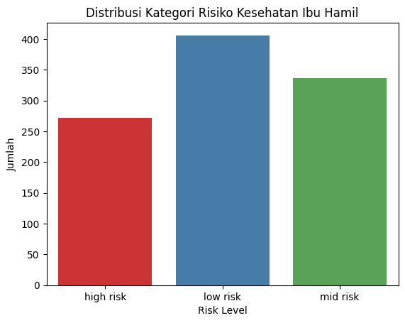
</p>

**Insight:**

1. Low Risk merupakan kategori terbanyak dengan proporsi sekitar 40% dari seluruh data. Ini menunjukkan sebagian besar ibu hamil dalam dataset berada dalam kondisi kesehatan yang relatif baik.
2. Mid Risk menempati urutan kedua dengan 33%, mengindikasikan bahwa sepertiga populasi berada dalam kondisi kesehatan yang perlu diperhatikan namun belum darurat.
3. High Risk hanya mencakup sekitar 27% dari data, artinya jumlah kasus kehamilan dengan risiko tinggi cukup signifikan tapi tidak dominan.
Distribusi kelas cukup seimbang, sehingga tidak terlalu bermasalah untuk model klasifikasi.

#### 4.1.2 Numerical Features
<p align="center">
  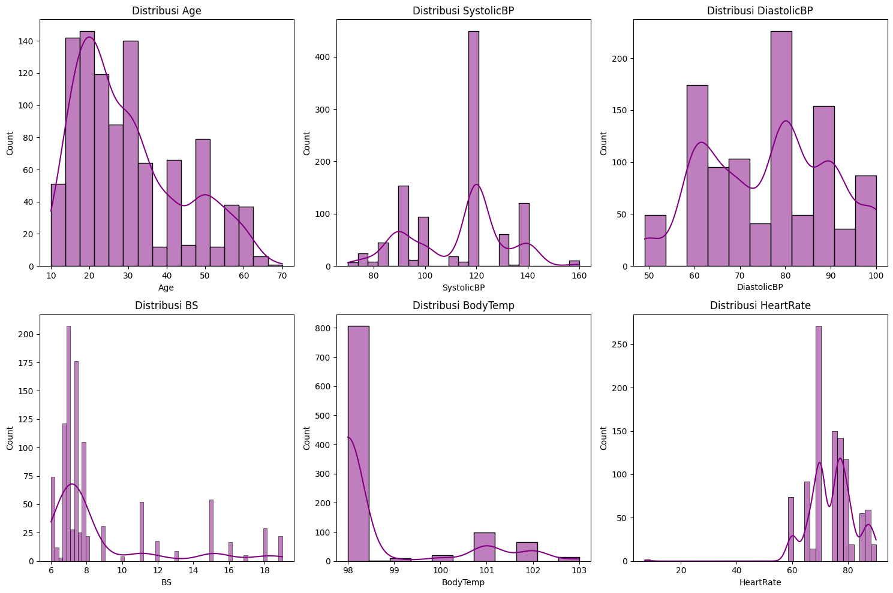
</p>

**Insight:**

1. **Age:** Mayoritas usia berada di 15–30 tahun, dengan puncak usia 20 tahun. Data didominasi oleh ibu muda.
2. **SystolicBP:** Puncak pada 120 mmHg, beberapa outlier pada 70 dan 160 mmHg.
3. **DiastolicBP:** Sebagian besar antara 60–90 mmHg, anomali di 100 mmHg.
4. **BS:** Skewed ke kanan, sebagian besar antara 6–9, outlier mencapai 19.
5. **BodyTemp:** Mayoritas 98°F, beberapa mencapai 103°F, skewed ke kanan.
6. **HeartRate:** Umumnya 60–85 bpm, puncak di 75–80 bpm. Ada nilai ekstrem.

---

### 4.2. Multivariate Analysis

#### 4.2.1 Distribusi Usia berdasarkan RiskLevel
<p align="center">
  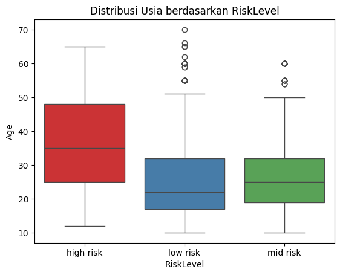
</p>

> **Insight : **Umur ibu dengan risiko tinggi cenderung lebih tua.

#### 4.2.2 Distribusi Tekanan Darah Sistolik berdasarkan RiskLevel
<p align="center">
  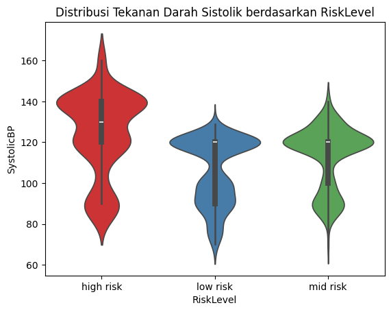
</p>

> **Insight : **Tekanan sistolik lebih tinggi dan variatif pada kelompok risiko tinggi.

#### 4.2.3 Distribusi Tekanan Darah Diastolik berdasarkan RiskLevel

<p align="center">
  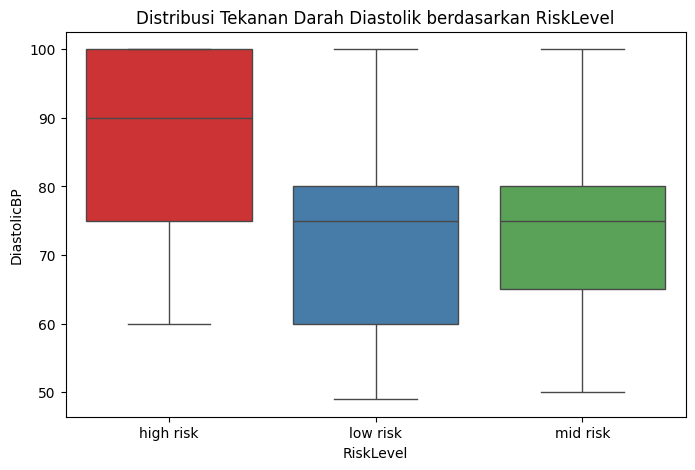
</p>

> **Insight : ** Tekanan diastolik lebih tinggi pada kelompok risiko tinggi.

#### 4.2.4 Distribusi Gula Darah berdasarkan RiskLevel

<p align="center">
  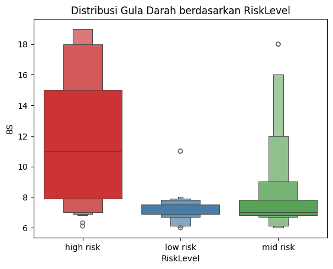
</p>

> **Insight : ** Gula darah pada risiko tinggi menunjukkan nilai tengah dan rentang lebih tinggi.

#### 4.2.5 Distribusi Suhu Tubuh berdasarkan RiskLevel

<p align="center">
  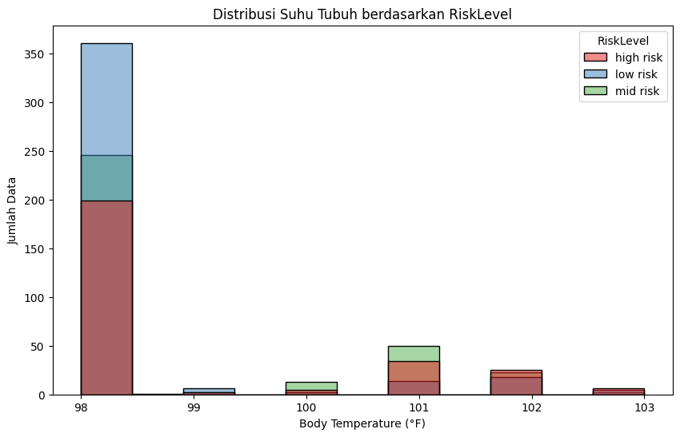
</p>

> **Insight : ** Suhu tubuh ibu berisiko tinggi sedikit lebih tersebar di suhu tinggi.

#### 4.2.6 Distribusi Detak Jantung berdasarkan RiskLevel

<p align="center">
  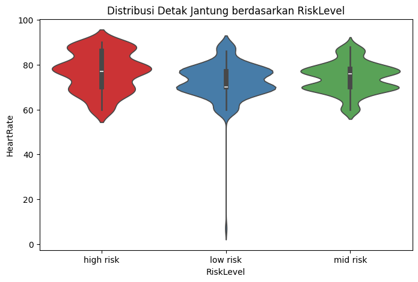
</p>

> **Insight : ** Detak jantung kelompok risiko tinggi sedikit lebih bervariasi.

---

## 5. Data Preparation

### 5.1 Duplicate Check

<p align="center">
  
</p>

<p align="center">
  
</p>

> Terdapat 562 data duplikat yang telah berhasil dihapus.

---

### 5.2 Missing Values

<p align="center">
  
</p>

> Tidak ada missing values ditemukan.

---

### 5.3 Handling Outlier (IQR Method)

<p align="center">
  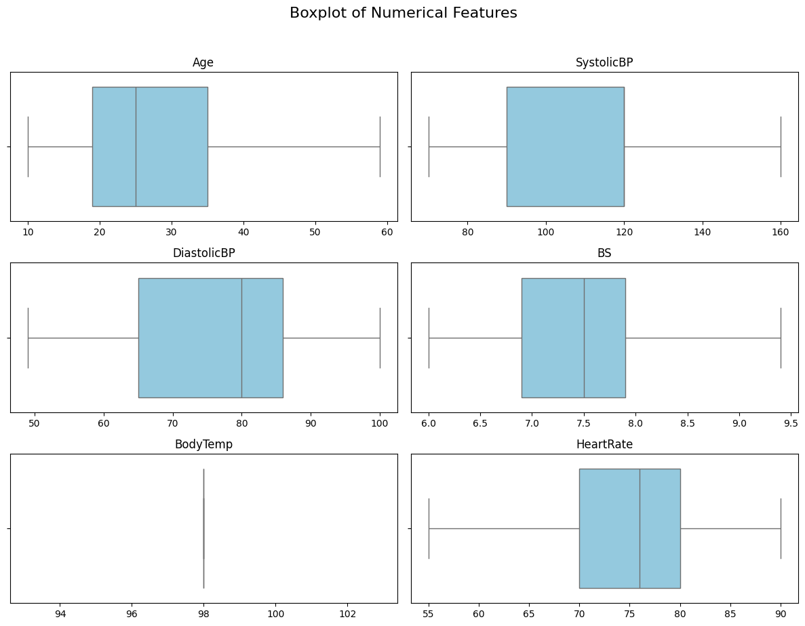
</p>

**Insight:**

- **HeartRate:** Nilai minimum 7 bpm — outlier ekstrem dan kemungkinan error.
- **SystolicBP & DiastolicBP:** Nilai rendah masih memungkinkan tapi perlu validasi.
- **BS:** Nilai maksimum 19 — bisa jadi outlier jika satuannya mg/dL.

> Setelah pembersihan, fitur numerik seperti Age, SystolicBP, DiastolicBP, dan HeartRate memiliki distribusi yang baik untuk digunakan dalam modeling.

### Encoding Variabel Kategorikal

<p align="center">
  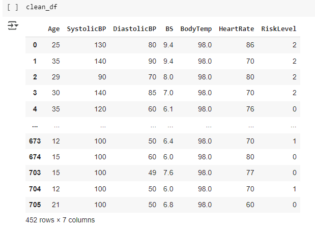
</p>

**Insight:**

Variabel kategorikal `RiskLevel` dikonversi ke bentuk numerik untuk mempermudah pemodelan klasifikasi:

- `low risk` → **0**  
- `mid risk` → **1**  
- `high risk` → **2**

> Encoding ini penting agar algoritma machine learning dapat memproses label target dengan benar.

---

### Train-Test Split

```python
from sklearn.model_selection import train_test_split

X = clean_df.drop(['RiskLevel'], axis=1)
y = clean_df['RiskLevel']

X_train, X_test, y_train, y_test = train_test_split(X, y, test_size = 0.2, random_state = 30)
```

**Ukuran Dataset:**

- `Total data`: **452 sampel**
- `X_train`: **361** (80%)
- `X_test`: **91** (20%)
- `Jumlah fitur`: **6** (BS, SystolicBP, DiastolicBP, HeartRate, Age, BodyTemp)

**Insight:**

- Proporsi 80:20 adalah standar dalam pembagian data untuk menjaga keseimbangan antara pelatihan dan evaluasi model.
- `random_state=30` menjaga konsistensi hasil pembagian data.
- Pembagian sudah sesuai dan tidak ada data yang hilang (361 + 91 = 452).

---

### Normalisasi Fitur Numerik

```python
from sklearn.preprocessing import MinMaxScaler

numerical_features = ['Age', 'SystolicBP', 'DiastolicBP', 'BS', 'BodyTemp', 'HeartRate']

scaler = MinMaxScaler()
scaler.fit(X_train[numerical_features])
X_train[numerical_features] = scaler.transform(X_train[numerical_features])
X_test[numerical_features] = scaler.transform(X_test[numerical_features])

X_train = X_train.values
X_test = X_test.values
```

**Insight:**

- MinMaxScaler digunakan untuk menyesuaikan skala fitur numerik ke rentang **0–1**.
- Scaling penting terutama untuk algoritma seperti **SVM, KNN**, dan **regresi logistik** yang sensitif terhadap perbedaan skala.
- `fit()` hanya dilakukan pada **X_train**, kemudian hasil transformasi diterapkan ke **X_train** dan **X_test** → ini mencegah **data leakage**.
- Konversi ke `.values` dilakukan agar kompatibel dengan beberapa framework modeling seperti **TensorFlow** atau **NumPy-based models**.

---

## Fungsi Evaluasi Model

```python
def evaluate_model(true_labels, predicted_labels, plot_title, class_labels=None):
    if class_labels is None:
        class_labels = [2, 0, 1]

    print(classification_report(true_labels, predicted_labels, target_names=[str(label) for label in class_labels]))

    fig, axis = plt.subplots(figsize=(10, 5))
    matrix = ConfusionMatrixDisplay.from_predictions(true_labels, predicted_labels, ax=axis, labels=class_labels)

    axis.set_xticklabels([str(label) for label in class_labels], rotation=90)
    axis.set_yticklabels([str(label) for label in class_labels])

    axis.grid(False)
    axis.set_title(plot_title)
    plt.tight_layout()
    plt.show()
```


## 6. Modeling

###6.1. **SVM (Support Vector Machine)**
#### Cara Kerja
SVM adalah algoritma supervised learning yang mencari hyperplane optimal untuk memisahkan kelas. Untuk data non-linear, digunakan kernel seperti `'rbf'` untuk memetakan data ke dimensi lebih tinggi agar dapat dipisahkan.

#### Parameter Utama
- `kernel='rbf'`: fungsi kernel radial basis function untuk menangani data non-linear.
- `class_weight='balanced'`: menyeimbangkan pengaruh setiap kelas berdasarkan frekuensi.
- `random_state=42`: agar hasil reproducible.

```python
from sklearn.svm import SVC

model_svm = SVC(kernel='rbf', random_state=42, class_weight='balanced')
model_svm.fit(X_train, y_train)

y_pred_encoded = model_svm.predict(X_test)
y_pred_labels = le.inverse_transform(y_pred_encoded)
y_test_labels = le.inverse_transform(y_test)

evaluate_model(y_test_labels, y_pred_labels, "Confusion Matrix Menggunakan Algoritma SVM", class_labels=target_nama)
```

#### Evaluasi
   <p align="center">
     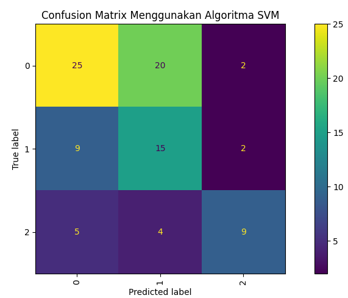
   </p>
   ```
              precision    recall  f1-score   support

       0       0.64      0.53      0.58        47
       1       0.38      0.58      0.46        26
       2       0.69      0.50      0.58        18

accuracy                           0.54        91
macro avg       0.57      0.54      0.54        91
weighted avg    0.58      0.54      0.55        91
```

#### Confusion Matrix (SVM)

|               | Predicted Low (0) | Predicted Mid (1) | Predicted High (2) |
|---------------|------------------|-------------------|--------------------|
| **Actual Low (0)**  | 25               | 20 *(FP)*          | 2                  |
| **Actual Mid (1)**  | 9 *(FN)*         | 15                 | 2                  |
| **Actual High (2)** | 5 *(FN)*         | 4                  | 9                  |

---

#### Ringkasan Metrik:

- **Akurasi**: 54%
- **Macro avg F1-score**: 0.54
- **Weighted avg F1-score**: 0.55

**Performa Per Kelas:**
- **Low Risk (0)**:
  - Precision: 0.64
  - Recall: 0.53
  - Banyak salah diklasifikasikan sebagai Mid (20 kasus).
- **Mid Risk (1)**:
  - Precision: 0.38, Recall: 0.58
  - Recall cukup baik, tapi precision rendah → banyak prediksi Mid yang salah.
- **High Risk (2)**:
  - Precision: 0.69, Recall: 0.50
  - Sekitar separuh data High Risk berhasil dikenali.

#### Insight:
- Model **tidak stabil antar kelas**, terutama kelas `Mid Risk`.
- Banyak kesalahan prediksi menuju kelas `Mid`, baik dari `Low` maupun `High`.
- Perlu peningkatan pada **pemisahan antar kelas**, terutama antara `Low` dan `Mid`.

---


Berikut format Markdown yang sudah rapih dan siap kamu copy-paste langsung:

```markdown
### 6.2 **KNN (K-Nearest Neighbors)**

#### Cara kerja
KNN adalah algoritma berbasis instance yang mengklasifikasikan data baru berdasarkan mayoritas kelas dari k tetangga terdekatnya. Jarak antar titik biasanya dihitung dengan metrik seperti Euclidean atau Manhattan.

#### Parameter Default
- `n_neighbors=5`
- `weights='uniform'`
- `metric='minkowski'`

##### 6.2.1 **KNN (K-Nearest Neighbors) sebelum Tuning**

```python
from sklearn.neighbors import KNeighborsClassifier

model_knn = KNeighborsClassifier(n_neighbors=5)
model_knn.fit(X_train, y_train)

y_pred = model_knn.predict(X_test)

y_pred_labels = le.inverse_transform(y_pred)
y_test_labels = le.inverse_transform(y_test)

evaluate_model(y_test_labels, y_pred_labels, "Confusion Matrix Menggunakan Algoritma KNN", class_labels=target_nama)
```

```
              precision    recall  f1-score   support

           0       0.59      0.94      0.72        47
           1       0.62      0.19      0.29        26
           2       0.88      0.39      0.54        18

    accuracy                           0.62        91
   macro avg       0.70      0.51      0.52        91
weighted avg       0.65      0.62      0.56        91
```

**Confusion Matrix (KNN):**

|                  | Predicted Low (0) | Predicted Mid (1) | Predicted High (2) |
|------------------|-------------------|-------------------|--------------------|
| Actual Low (0)    | 44                | 2                 | 1                  |
| Actual Mid (1)    | 21 (False Negative)| 5                 | 0                  |
| Actual High (2)   | 10 (False Negative)| 1                 | 7                  |

**Ringkasan Metrik:**

- Accuracy: 62%
- Macro avg F1-score: 0.52
- Weighted avg F1-score: 0.56

**Per Kelas:**

- Low Risk (0)  
  Precision: 0.59, Recall: 0.94  
  Hampir semua low risk dikenali, tapi precision sedang.

- Mid Risk (1)  
  Precision: 0.62, Recall: 0.19  
  Mayoritas data mid risk salah dikira low risk.

- High Risk (2)  
  Precision: 0.88, Recall: 0.39  
  Prediksi cukup tepat, tapi recall rendah.

**Kesimpulan:**  
Model kuat mengenali kelas Low Risk, namun masih lemah untuk Mid dan High Risk.

---

##### 6.2.2 **KNN (K-Nearest Neighbors) setelah Tuning**

```python
import optuna
from sklearn.metrics import accuracy_score

def objective(trial):
    n_neighbors = trial.suggest_int("n_neighbors", 1, 30)
    weights = trial.suggest_categorical("weights", ["uniform", "distance"])
    metric = trial.suggest_categorical("metric", ["euclidean", "manhattan", "minkowski"])

    model = KNeighborsClassifier(
        n_neighbors=n_neighbors,
        weights=weights,
        metric=metric
    )

    model.fit(X_train, y_train)
    y_pred = model.predict(X_test)
    acc = accuracy_score(y_test, y_pred)
    return acc

study_knn = optuna.create_study(direction="maximize")
study_knn.optimize(objective, n_trials=100)

print("Best hyperparameters:", study_knn.best_params)
print("Best accuracy:", study_knn.best_value)

best_params = study_knn.best_params

best_knn = KNeighborsClassifier(
    n_neighbors=best_params["n_neighbors"],
    weights=best_params["weights"],
    metric=best_params["metric"]
)

best_knn.fit(X_train, y_train)
y_pred = best_knn.predict(X_test)

y_pred_labels = le.inverse_transform(y_pred)
y_test_labels = le.inverse_transform(y_test)

accuracy_knn_opt = round(accuracy_score(y_test, y_pred) * 100, 2)
print(f"Akurasi KNN setelah tuning: {accuracy_knn_opt}%")

evaluate_model(y_test_labels, y_pred_labels, "Confusion Matrix KNN Setelah Tuning", class_labels=target_nama)
```

```
              precision    recall  f1-score   support

           0       0.62      1.00      0.76        47
           1       0.83      0.19      0.31        26
           2       1.00      0.50      0.67        18

    accuracy                           0.67        91
   macro avg       0.82      0.56      0.58        91
weighted avg       0.76      0.67      0.62        91
```

**Confusion Matrix (KNN Setelah Tuning):**

|                  | Predicted Low (0) | Predicted Mid (1) | Predicted High (2) |
|------------------|-------------------|-------------------|--------------------|
| Actual Low (0)    | 47                | 0                 | 0                  |
| Actual Mid (1)    | 21 (False Negative)| 5                 | 0                  |
| Actual High (2)   | 8 (False Negative) | 1                 | 9                  |

**Ringkasan Metrik:**

- Accuracy: 67%
- Macro avg F1-score: 0.58
- Weighted avg F1-score: 0.62

**Per Kelas:**

- Low Risk (0)  
  Precision: 0.62, Recall: 1.00  
  Semua low risk dikenali dengan benar.

- Mid Risk (1)  
  Precision: 0.83, Recall: 0.19  
  Model masih gagal mengenali mayoritas mid risk.

- High Risk (2)  
  Precision: 1.00, Recall: 0.50  
  Prediksi sangat tepat untuk high risk, namun recall masih rendah.

**Kesimpulan:**  
Tuning meningkatkan akurasi dari 62% menjadi 67%. Model semakin baik mengenali Low Risk secara sempurna, tapi performa kelas Mid dan High masih perlu perbaikan.

```

### 6.3. **Random Forest**
#### Cara Kerja
Random Forest adalah ensemble learning berbasis decision tree. Model membentuk banyak pohon (tree) dan menggabungkan hasil voting/average untuk meningkatkan akurasi dan mengurangi overfitting.

##### Parameter Default
- `random_state=42`: untuk memastikan hasil konsisten.

```python
from sklearn.ensemble import RandomForestClassifier

rf_model = RandomForestClassifier(random_state=42)
rf_model.fit(X_train, y_train)

y_pred = rf_model.predict(X_test)

evaluate_model(y_test, y_pred, "Confusion Matrix Menggunakan Algoritma Random Forest", class_labels=target_nama)
```

##### Evaluasi Awal
<p align="center">
     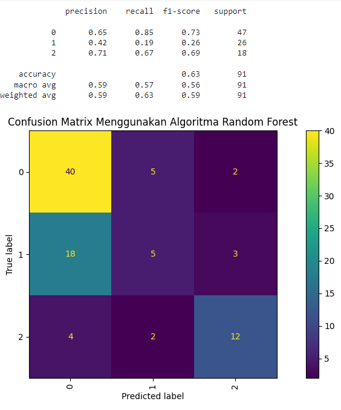

```
              precision    recall  f1-score   support

       0       0.65      0.85      0.73        47
       1       0.42      0.19      0.26        26
       2       0.71      0.67      0.69        18

accuracy                           0.63        91
macro avg       0.59      0.57      0.56        91
weighted avg    0.59      0.63      0.59        91
```

---

#### 6.3.2 Tuning Random Forest dengan Optuna

```python
import optuna

def objective(trial):
    params = {
        'n_estimators': trial.suggest_int('n_estimators', 50, 300),
        'max_depth': trial.suggest_int('max_depth', 5, 30),
        'min_samples_split': trial.suggest_int('min_samples_split', 2, 10),
        'min_samples_leaf': trial.suggest_int('min_samples_leaf', 1, 10),
        'max_features': trial.suggest_categorical('max_features', ['sqrt', 'log2', None]),
        'bootstrap': trial.suggest_categorical('bootstrap', [True, False]),
        'random_state': 42
    }
    model = RandomForestClassifier(**params)
    model.fit(X_train, y_train)
    y_pred = model.predict(X_test)
    return accuracy_score(y_test, y_pred)

study_rf = optuna.create_study(direction='maximize')
study_rf.optimize(objective, n_trials=100)

print("Best hyperparameters:", study_rf.best_params)
print("Best accuracy:", study_rf.best_value)
```

Setelah tuning:

```python
best_params_rf = study_rf.best_params

best_rf = RandomForestClassifier(
    **best_params_rf,
    random_state=42,
    n_jobs=-1
)

best_rf.fit(X_train, y_train)
y_pred_rf = best_rf.predict(X_test)

y_pred_labels_rf = le.inverse_transform(y_pred_rf)
y_test_labels_rf = le.inverse_transform(y_test)

evaluate_model(y_test_labels_rf, y_pred_labels_rf, "Confusion Matrix Random Forest Setelah Tuning", class_labels=target_nama)
```

---

#### Evaluasi Setelah Tuning

   <p align="center">
     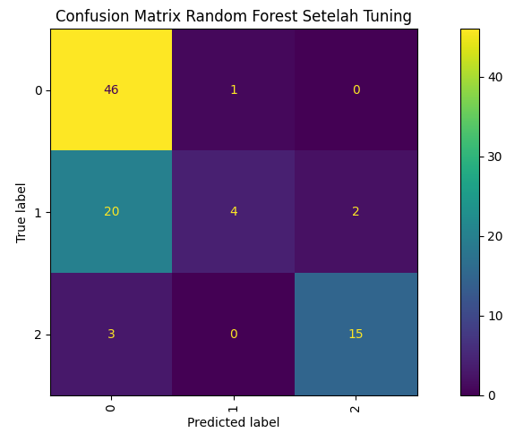
   </p>
   
```
              precision    recall  f1-score   support

       0       0.67      0.98      0.79        47
       1       0.80      0.15      0.26        26
       2       0.88      0.83      0.86        18

accuracy                           0.71        91
macro avg       0.78      0.66      0.64        91
weighted avg    0.75      0.71      0.65        91
```

#### Confusion Matrix (Setelah Tuning)

|                | Pred Low (0) | Pred Mid (1) | Pred High (2) |
|----------------|--------------|---------------|----------------|
| **Actual Low (0)**  | 46           | 1             | 0              |
| **Actual Mid (1)**  | 20           | 4             | 2              |
| **Actual High (2)** | 3            | 0             | 15             |

---

#### Ringkasan Metrik:

- **Akurasi**: 71.43%
- **Macro Avg F1-score**: 0.64
- **Weighted Avg F1-score**: 0.65

**Performa Per Kelas:**
- **Low Risk (0)**:
  - Precision: 0.67 | Recall: 0.98 | F1-score: 0.79
  - Hampir semua prediksi tepat.
- **Mid Risk (1)**:
  - Precision: 0.80 | Recall: 0.15 | F1-score: 0.26
  - Recall sangat rendah, banyak Mid Risk tidak dikenali.
- **High Risk (2)**:
  - Precision: 0.88 | Recall: 0.83 | F1-score: 0.86
  - Sangat baik dalam mendeteksi kelas berisiko tinggi.

---

#### Insight:
Random Forest dengan tuning **merupakan model terbaik sejauh ini** karena:

- **Akurasi tertinggi**: 71.43%
- **F1-score tertinggi untuk High Risk**: 0.86
- **Stabil dalam mengenali Low dan High Risk**

Namun, kelemahannya tetap sama seperti model lain:
- **Kelas Mid Risk sulit dikenali**, dengan recall hanya 0.15.
- Disarankan melakukan penanganan ketidakseimbangan data, misalnya dengan:
  - Oversampling kelas Mid
  - SMOTE
  - Class weight khusus

---

### 6.4. **XGBoost**
  #### 6.4.1 **XGBoost Before Tuning**
  <p align="center">
     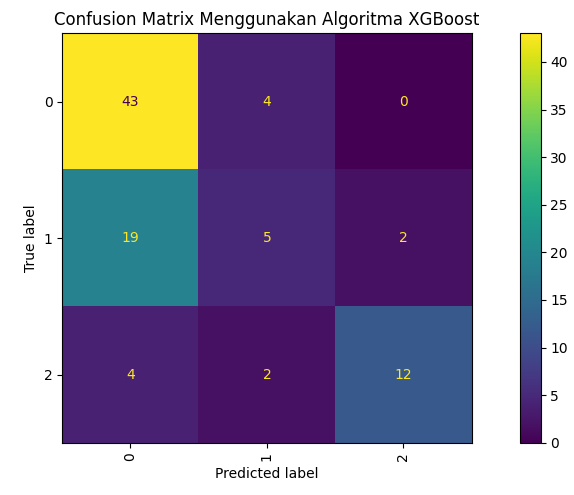
   </p>
   ###### Cara Kerja
XGBoost (Extreme Gradient Boosting) adalah algoritma boosting berbasis pohon keputusan yang membangun model secara bertahap dengan meminimalkan kesalahan dari model sebelumnya. Cocok untuk dataset tabular dan kompetisi ML.

##### Parameter Utama
- `max_depth=5`: mengontrol kedalaman pohon (kompleksitas model).
- `n_estimators=168`: jumlah total pohon yang dibangun.
- `learning_rate=0.0439`: seberapa besar kontribusi setiap pohon.
- `scale_pos_weight=[1.0, 2.2, 2.5]`: penyesuaian untuk kelas tidak seimbang.
- `objective='multi:softprob'`: untuk klasifikasi multi-kelas.

```python
model_xgb = XGBClassifier(
    max_depth=5,
    n_estimators=168,
    learning_rate=0.04396509567813328,
    random_state=9,
    n_jobs=-1,
    objective='multi:softprob',
    num_class=3,
    eval_metric='mlogloss',
    scale_pos_weight=[1.0, 2.2, 2.5]
)
model_xgb.fit(X_train, y_train)
pred_xgb = model_xgb.predict(X_test)

y_pred_labels = le.inverse_transform(pred_xgb)
y_test_labels = le.inverse_transform(y_test)

accuracy_xgboost= round(accuracy_score(y_test, pred_xgb)*100,2)
print("Hasil akurasi model xgboost: ", accuracy_xgboost, "%")
evaluate_model(y_test_labels, y_pred_labels, "Confusion Matrix Menggunakan Algoritma XGBoost", class_labels=target_nama)
```

##### Evaluasi

```
              precision    recall  f1-score   support

       0       0.65      0.91      0.76        47
       1       0.45      0.19      0.27        26
       2       0.86      0.67      0.75        18

accuracy                           0.66        91
macro avg       0.65      0.59      0.59        91
weighted avg    0.64      0.66      0.62        91
```

**Insight:**
- Akurasi keseluruhan: **65.93%**
- Model cukup akurat untuk kelas `Low Risk`, namun kesulitan membedakan `Mid` dan sebagian `High`.
- Kesalahan umum: `Mid` sering diklasifikasikan sebagai `Low`.

### 6.4.2 XGBoost After Tuning
 <p align="center">
     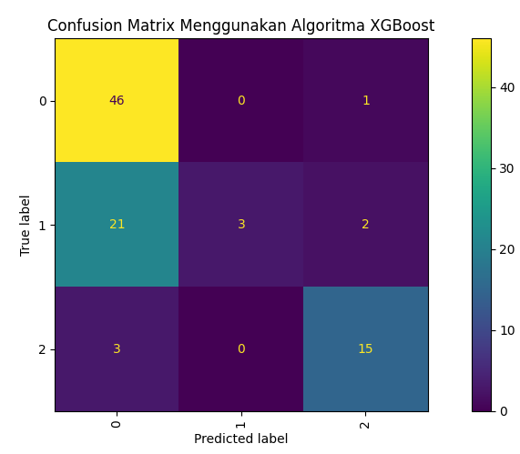
   </p>
#### Hasil dan Evaluasi Model Terbaik

```python
best_model = XGBClassifier(
    max_depth=study_xgboost.best_params['max_depth'],
    n_estimators=study_xgboost.best_params['n_estimators'],
    learning_rate=study_xgboost.best_params['learning_rate'],
    random_state=study_xgboost.best_params['random_state'],
    n_jobs=-1,
    eval_metric='mlogloss',
    objective='multi:softprob',
    num_class=num_class
)

best_model.fit(X_train, y_train)
y_pred = best_model.predict(X_test)
evaluate_model(y_test, y_pred, "Confusion Matrix Menggunakan Algoritma XGBoost (Tuning)", class_labels=target_nama)
```

#### Evaluasi Setelah Tuning

```
              precision    recall  f1-score   support

       0       0.66      0.98      0.79        47
       1       1.00      0.12      0.21        26
       2       0.83      0.83      0.83        18

accuracy                           0.70        91
macro avg       0.83      0.64      0.61        91
weighted avg    0.79      0.70      0.63        91
```

**Insight:**
- Akurasi meningkat menjadi **70%** setelah tuning.
- Recall kelas `Low` sangat tinggi (**0.98**), namun recall `Mid` masih sangat rendah (**0.12**).
- Distribusi kelas tetap menjadi tantangan utama, terutama pada `Mid Risk`.


## 📝 Kesimpulan

- **Random Forest** menunjukkan performa terbaik setelah tuning dengan akurasi 71.43%.
- **SVM** memberikan performa paling rendah.
- **KNN** mengalami peningkatan performa signifikan setelah dilakukan tuning parameter.

## 📌 Catatan

- Semua visualisasi disimpan di folder `images/`.
- Notebook utama: [`predictive_analysis_maternal_risk.ipynb`](predictive_analysis_maternal_risk.ipynb)

---

## Perbandingan Akurasi Model

Berikut adalah grafik perbandingan akurasi keempat model :

<p align="center">
  
</p>

## 🔍 Feature Importance

Berikut adalah grafik feature importance dari model Random Forest:


