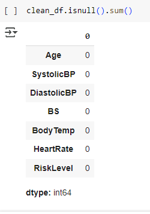

# Proyek Prediksi Risiko Kesehatan Maternal

## 1. Domain Proyek

Kesehatan maternal (ibu hamil) merupakan aspek krusial dalam sistem pelayanan kesehatan karena berhubungan langsung dengan keselamatan ibu dan bayi. Menurut World Health Organization (WHO), lebih dari 700 wanita meninggal setiap hari sepanjang tahun 2023 akibat penyebab yang sebenarnya dapat dicegah terkait kehamilan dan persalinan. Artinya, setiap 2 menit terjadi satu kematian maternal di dunia.

Walaupun telah terjadi penurunan sekitar 40% angka kematian maternal secara global sejak tahun 2000, angka ini masih tinggi di negara berpendapatan rendah dan menengah ke bawah. Lebih dari 90% kematian maternal tahun 2023 terjadi di kelompok negara ini. Padahal, kematian tersebut dapat dicegah dengan perawatan tepat dari tenaga kesehatan profesional, baik sebelum, saat, maupun setelah persalinan.

Dengan bantuan teknologi machine learning, kita dapat membangun sistem prediksi risiko kesehatan maternal untuk membantu tenaga medis dalam mengidentifikasi ibu hamil berisiko tinggi. Deteksi dini ini penting untuk mempercepat penanganan medis dan menyelamatkan nyawa.

---

## 2. Business Understanding

### 2.1 Problem Statements

- Bagaimana cara mengklasifikasikan risiko kesehatan maternal (low, mid, high) berdasarkan data vital pasien?
- Apakah model machine learning dapat memberikan klasifikasi risiko yang akurat dan dapat diandalkan dalam pengambilan keputusan medis?
- Fitur apa saja yang paling berkontribusi terhadap klasifikasi risiko maternal, dan bagaimana pengaruhnya terhadap tingkat akurasi model?

### 2.2 Goals
 
- Mengembangkan sistem klasifikasi risiko kesehatan maternal berbasis data medis dasar.
- Menerapkan dan membandingkan beberapa algoritma machine learning untuk mendapatkan model terbaik.
- Mengevaluasi performa model menggunakan metrik evaluasi yang sesuai (confusion matrix, akurasi, dsb).

### 2.3 Solution Statements

- Melakukan analisis statistik dan membangun model machine learning untuk mengukur kontribusi parameter medis (seperti tekanan darah, kadar hemoglobin, usia kehamilan, dll) terhadap klasifikasi risiko.
- Menerapkan beberapa algoritma machine learning dan membandingkan performa akurasi model dalam memprediksi risiko kesehatan maternal.
- Memberikan insight medis melalui analisis kombinasi variabel terhadap tingkat risiko maternal untuk membantu deteksi dini potensi komplikasi kehamilan.

---

## 2.4 Metodologi

Metodologi yang digunakan adalah klasifikasi multi-kelas dengan beberapa algoritma machine learning untuk mengelompokkan risiko menjadi tiga kategori:

- **Low Risk**
- **Mid Risk**
- **High Risk**

Langkah utama dalam proyek ini:

1. Eksplorasi dan pemahaman data
2. Preprocessing dan pembagian data
3. Penerapan algoritma klasifikasi seperti:
   - SVM
   - KNN
   - Random Forest
   - XGBoost
4. Evaluasi performa model menggunakan confusion matrix dan metrik akurasi

---

## Metrik Evaluasi

- **Confusion Matrix**: Untuk mengevaluasi jumlah prediksi benar dan salah dari masing-masing kelas.
- **Accuracy**: Untuk mengetahui persentase prediksi yang benar secara keseluruhan.

---

## 3. Data Understanding

- **Sumber Dataset**: [Maternal Health Risk Data - UCI Repository](https://archive.ics.uci.edu/dataset/863/maternal+health+risk)
- **Jumlah Data**: 1.014 baris (data pasien ibu hamil)
- **Jumlah Fitur**: 7 kolom (fitur) termasuk label target
- **Missing Values**: Tidak ada

### Deskripsi Variabel

| Fitur       | Tipe     | Deskripsi                                                          |
| ----------- | -------- | ------------------------------------------------------------------ |
| Age         | Numerik  | Usia ibu hamil (tahun)                                             |
| SystolicBP  | Numerik  | Tekanan darah sistolik (mm Hg)                                     |
| DiastolicBP | Numerik  | Tekanan darah diastolik (mm Hg)                                    |
| BS          | Numerik  | Kadar gula darah (mg/dl)                                           |
| BodyTemp    | Numerik  | Suhu tubuh dalam °C (ada yang menuliskan °F, perlu validasi ulang) |
| HeartRate   | Numerik  | Detak jantung per menit (bpm)                                      |
| RiskLevel   | Kategori | Target label: Low, Mid, High                                       |

---

## Insight

- Dataset bersih tanpa missing values.
- Semua fitur adalah numerik kecuali `RiskLevel` sebagai label klasifikasi.
- Kombinasi variabel seperti tekanan darah, kadar gula, dan usia dapat memberikan indikasi kuat terhadap klasifikasi risiko kehamilan.

---

## 4. Exploratory Data Analysis (EDA)

### 4.1 Univariate Analysis

<p align="center">
  
</p>

<p align="center">
  
</p>

**Insight:**

1. **Age:** Mayoritas usia berada di 15–30 tahun, dengan puncak usia 20 tahun. Data didominasi oleh ibu muda.
2. **SystolicBP:** Puncak pada 120 mmHg, beberapa outlier pada 70 dan 160 mmHg.
3. **DiastolicBP:** Sebagian besar antara 60–90 mmHg, anomali di 100 mmHg.
4. **BS:** Skewed ke kanan, sebagian besar antara 6–9, outlier mencapai 19.
5. **BodyTemp:** Mayoritas 98°F, beberapa mencapai 103°F, skewed ke kanan.
6. **HeartRate:** Umumnya 60–85 bpm, puncak di 75–80 bpm. Ada nilai ekstrem.

---

### 4.2. Multivariate Analysis

<p align="center">
  
</p>

> Umur ibu dengan risiko tinggi cenderung lebih tua.

<p align="center">
  
</p>

> Tekanan sistolik lebih tinggi dan variatif pada kelompok risiko tinggi.

<p align="center">
  
</p>

> Tekanan diastolik lebih tinggi pada kelompok risiko tinggi.

<p align="center">
  
</p>

> Gula darah pada risiko tinggi menunjukkan nilai tengah dan rentang lebih tinggi.

<p align="center">
  
</p>

> Suhu tubuh ibu berisiko tinggi sedikit lebih tersebar di suhu tinggi.

<p align="center">
  
</p>

> Detak jantung kelompok risiko tinggi sedikit lebih bervariasi.

---

## 5. Data Preparation

### 5.1 Duplicate Check

<p align="center">
  
</p>

<p align="center">
  
</p>

> Terdapat 562 data duplikat yang telah berhasil dihapus.

---

### 5.2 Missing Values

<p align="center">
  
</p>

> Tidak ada missing values ditemukan.

---

### 5.3 Handling Outlier (IQR Method)

<p align="center">
  
</p>

**Insight:**

- **HeartRate:** Nilai minimum 7 bpm — outlier ekstrem dan kemungkinan error.
- **SystolicBP & DiastolicBP:** Nilai rendah masih memungkinkan tapi perlu validasi.
- **BS:** Nilai maksimum 19 — bisa jadi outlier jika satuannya mg/dL.

> Setelah pembersihan, fitur numerik seperti Age, SystolicBP, DiastolicBP, dan HeartRate memiliki distribusi yang baik untuk digunakan dalam modeling.

### Encoding Variabel Kategorikal

<p align="center">
  
</p>

**Insight:**

Variabel kategorikal `RiskLevel` dikonversi ke bentuk numerik untuk mempermudah pemodelan klasifikasi:

- `low risk` → **0**  
- `mid risk` → **1**  
- `high risk` → **2**

> Encoding ini penting agar algoritma machine learning dapat memproses label target dengan benar.

---

### Train-Test Split

```python
from sklearn.model_selection import train_test_split

X = clean_df.drop(['RiskLevel'], axis=1)
y = clean_df['RiskLevel']

X_train, X_test, y_train, y_test = train_test_split(X, y, test_size = 0.2, random_state = 30)
```

**Ukuran Dataset:**

- `Total data`: **452 sampel**
- `X_train`: **361** (80%)
- `X_test`: **91** (20%)
- `Jumlah fitur`: **6** (BS, SystolicBP, DiastolicBP, HeartRate, Age, BodyTemp)

**Insight:**

- Proporsi 80:20 adalah standar dalam pembagian data untuk menjaga keseimbangan antara pelatihan dan evaluasi model.
- `random_state=30` menjaga konsistensi hasil pembagian data.
- Pembagian sudah sesuai dan tidak ada data yang hilang (361 + 91 = 452).

---

### Normalisasi Fitur Numerik

```python
from sklearn.preprocessing import MinMaxScaler

numerical_features = ['Age', 'SystolicBP', 'DiastolicBP', 'BS', 'BodyTemp', 'HeartRate']

scaler = MinMaxScaler()
scaler.fit(X_train[numerical_features])
X_train[numerical_features] = scaler.transform(X_train[numerical_features])
X_test[numerical_features] = scaler.transform(X_test[numerical_features])

X_train = X_train.values
X_test = X_test.values
```

**Insight:**

- MinMaxScaler digunakan untuk menyesuaikan skala fitur numerik ke rentang **0–1**.
- Scaling penting terutama untuk algoritma seperti **SVM, KNN**, dan **regresi logistik** yang sensitif terhadap perbedaan skala.
- `fit()` hanya dilakukan pada **X_train**, kemudian hasil transformasi diterapkan ke **X_train** dan **X_test** → ini mencegah **data leakage**.
- Konversi ke `.values` dilakukan agar kompatibel dengan beberapa framework modeling seperti **TensorFlow** atau **NumPy-based models**.

---

## Fungsi Evaluasi Model

```python
def evaluate_model(true_labels, predicted_labels, plot_title, class_labels=None):
    if class_labels is None:
        class_labels = [2, 0, 1]

    print(classification_report(true_labels, predicted_labels, target_names=[str(label) for label in class_labels]))

    fig, axis = plt.subplots(figsize=(10, 5))
    matrix = ConfusionMatrixDisplay.from_predictions(true_labels, predicted_labels, ax=axis, labels=class_labels)

    axis.set_xticklabels([str(label) for label in class_labels], rotation=90)
    axis.set_yticklabels([str(label) for label in class_labels])

    axis.grid(False)
    axis.set_title(plot_title)
    plt.tight_layout()
    plt.show()
```


## 6 Model yang Digunakan

###6.1. **SVM (Support Vector Machine)**

   - Akurasi: 53.85%
   <p align="center">
     
   </p>

### 6.2 **KNN (K-Nearest Neighbors)**

   - Akurasi awal: 62%
   - Akurasi setelah tuning: 67.03%
   <p align="center">
     
   </p>
   <p align="center">
     
   </p>

### 6.3. **Random Forest**

   - Akurasi setelah tuning: 71.43%
   <p align="center">
     
   </p>
   <p align="center">
     
   </p>

### 6.4. **XGBoost**
  ### 6.4.1 **XGBoost Before Tuning**
   ##### Cara Kerja
XGBoost (Extreme Gradient Boosting) adalah algoritma boosting berbasis pohon keputusan yang membangun model secara bertahap dengan meminimalkan kesalahan dari model sebelumnya. Cocok untuk dataset tabular dan kompetisi ML.

#### Parameter Utama
- `max_depth=5`: mengontrol kedalaman pohon (kompleksitas model).
- `n_estimators=168`: jumlah total pohon yang dibangun.
- `learning_rate=0.0439`: seberapa besar kontribusi setiap pohon.
- `scale_pos_weight=[1.0, 2.2, 2.5]`: penyesuaian untuk kelas tidak seimbang.
- `objective='multi:softprob'`: untuk klasifikasi multi-kelas.

```python
model_xgb = XGBClassifier(
    max_depth=5,
    n_estimators=168,
    learning_rate=0.04396509567813328,
    random_state=9,
    n_jobs=-1,
    objective='multi:softprob',
    num_class=3,
    eval_metric='mlogloss',
    scale_pos_weight=[1.0, 2.2, 2.5]
)
model_xgb.fit(X_train, y_train)
pred_xgb = model_xgb.predict(X_test)

y_pred_labels = le.inverse_transform(pred_xgb)
y_test_labels = le.inverse_transform(y_test)

accuracy_xgboost= round(accuracy_score(y_test, pred_xgb)*100,2)
print("Hasil akurasi model xgboost: ", accuracy_xgboost, "%")
evaluate_model(y_test_labels, y_pred_labels, "Confusion Matrix Menggunakan Algoritma XGBoost", class_labels=target_nama)
```

#### Evaluasi

```
              precision    recall  f1-score   support

       0       0.65      0.91      0.76        47
       1       0.45      0.19      0.27        26
       2       0.86      0.67      0.75        18

accuracy                           0.66        91
macro avg       0.65      0.59      0.59        91
weighted avg    0.64      0.66      0.62        91
```

**Insight:**
- Akurasi keseluruhan: **65.93%**
- Model cukup akurat untuk kelas `Low Risk`, namun kesulitan membedakan `Mid` dan sebagian `High`.
- Kesalahan umum: `Mid` sering diklasifikasikan sebagai `Low`.

### 6.4.2 XGBoost After Tuning
#### Hasil dan Evaluasi Model Terbaik

```python
best_model = XGBClassifier(
    max_depth=study_xgboost.best_params['max_depth'],
    n_estimators=study_xgboost.best_params['n_estimators'],
    learning_rate=study_xgboost.best_params['learning_rate'],
    random_state=study_xgboost.best_params['random_state'],
    n_jobs=-1,
    eval_metric='mlogloss',
    objective='multi:softprob',
    num_class=num_class
)

best_model.fit(X_train, y_train)
y_pred = best_model.predict(X_test)
evaluate_model(y_test, y_pred, "Confusion Matrix Menggunakan Algoritma XGBoost (Tuning)", class_labels=target_nama)
```

#### Evaluasi Setelah Tuning

```
              precision    recall  f1-score   support

       0       0.66      0.98      0.79        47
       1       1.00      0.12      0.21        26
       2       0.83      0.83      0.83        18

accuracy                           0.70        91
macro avg       0.83      0.64      0.61        91
weighted avg    0.79      0.70      0.63        91
```

**Insight:**
- Akurasi meningkat menjadi **70%** setelah tuning.
- Recall kelas `Low` sangat tinggi (**0.98**), namun recall `Mid` masih sangat rendah (**0.12**).
- Distribusi kelas tetap menjadi tantangan utama, terutama pada `Mid Risk`.

---

---
   <p align="center">
     
   </p>
   <p align="center">
     
   </p>

---

## 📝 Kesimpulan

- **Random Forest** menunjukkan performa terbaik setelah tuning dengan akurasi 71.43%.
- **SVM** memberikan performa paling rendah.
- **KNN** mengalami peningkatan performa signifikan setelah dilakukan tuning parameter.

## 📌 Catatan

- Semua visualisasi disimpan di folder `images/`.
- Notebook utama: [`predictive_analysis_maternal_risk.ipynb`](predictive_analysis_maternal_risk.ipynb)

---

## Perbandingan Akurasi Model

Berikut adalah grafik perbandingan akurasi keempat model :

<p align="center">
  
</p>

## 🔍 Feature Importance

Berikut adalah grafik feature importance dari model Random Forest:


